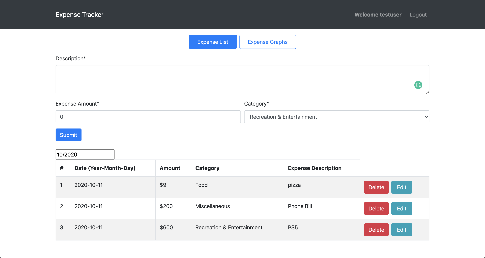
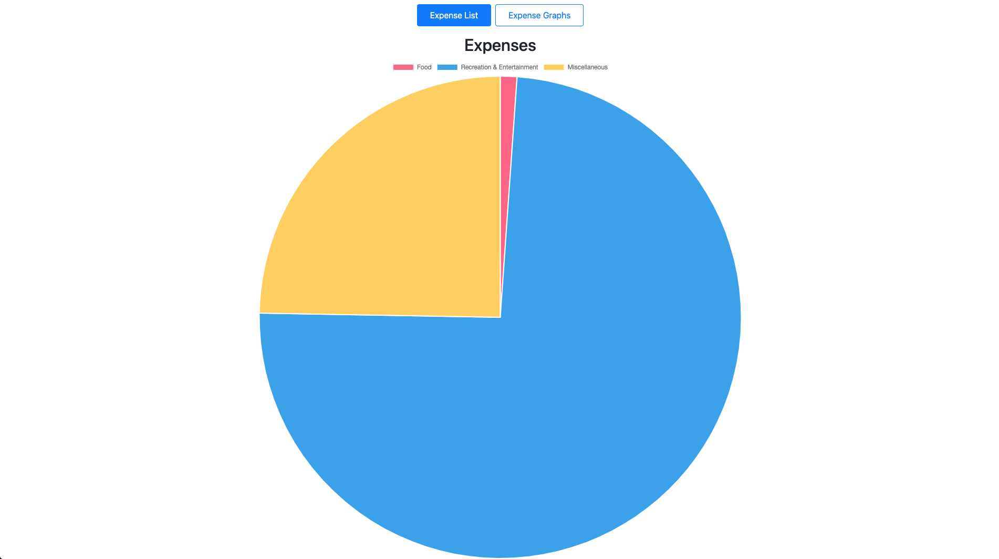

# Expense Tracker

A personal expense tracker that tracks your monthly personal expenses

#### [Expense Tracker Backend Link here](https://github.com/jolouie7/expense-tracker-mern)

#### [Live Site](https://my-expense-tracker-78b780.netlify.app/)




## Getting Started

#### Frontend:
Install Dependencies
```
npm install
```
Setup REACT_APP_BACKEND_HOST in .env to be http://localhost:5000 for development
```
REACT_APP_BACKEND_HOST=http://localhost:5000
```
Start App
```
npm start
```

#### Backend:
Install Dependencies
```
npm install
```
setup .env file
```
MONGODB_URI=Your Mongodb URI
JWT_SECRET=Your random secret key
```
Run dev environment
```
npm run dev
```

## Built With

* [React Hooks](https://reactjs.org/)
* [Redux](https://redux.js.org/)
* [Cypress](https://www.cypress.io/)
* [React Bootstrap](https://react-bootstrap.github.io/)
* [React Datepicker](https://github.com/Hacker0x01/react-datepicker/)
* [React Chartjs](https://github.com/jerairrest/react-chartjs-2)
* [Nodejs](https://nodejs.org/en/)
* [Express](https://www.express.com/)
* [MongoDB](https://www.mongodb.com/)

## Features
* Full CRUD funtionality
* Authentication and Authorization using JWT
* Testing with Cypress.io
* Displays a pie chart of monthly expenses
* Filter expenses by month

## Future Features
* Add more tests
* Add a couple more charts
* Improve landing page

## License

This project is licensed under the MIT License - see the [LICENSE.md](LICENSE.md) file for details